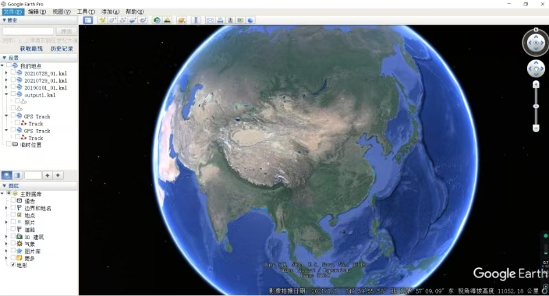
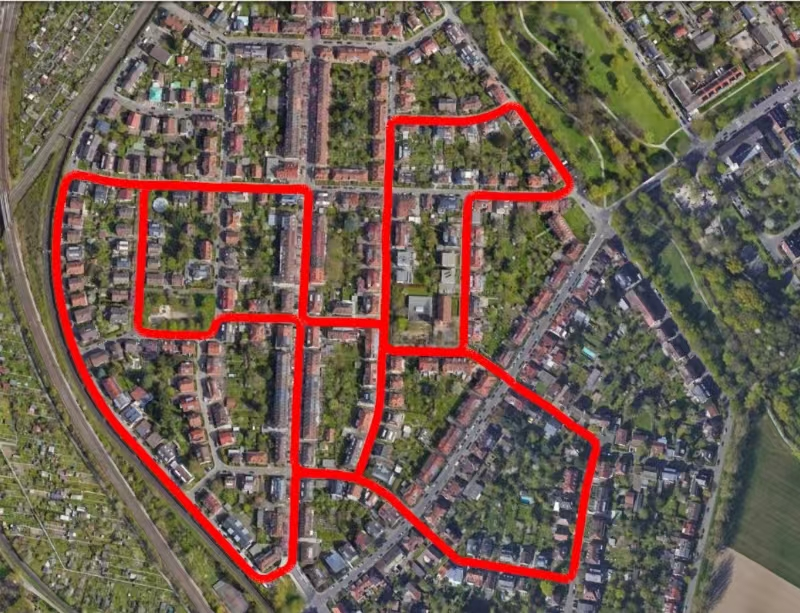
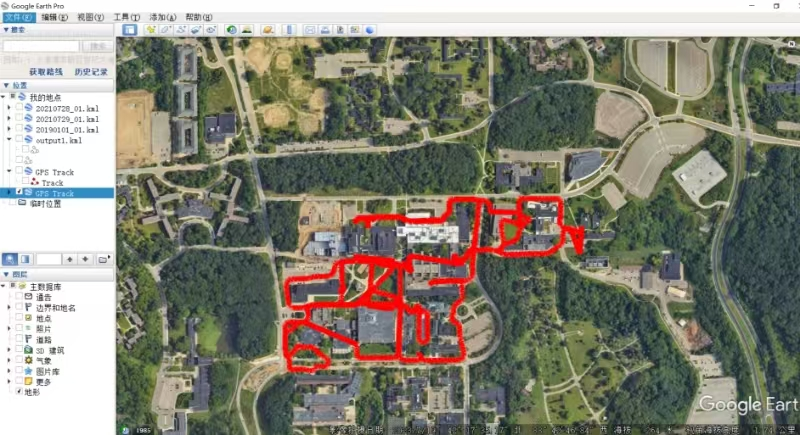

# Vis_GT
Display the ground truth of KITTI and NCLT dataste on Google Earth

# Usage
## KITTI Dataset
* **step 1**: kitti数据集的GPS数据需要下载raw data,在对应的```oxts/data```的路径中,先生成kitti_gps_00.csv文件，运行：
```bash
python read_kitti_gps.py
```
* **step 2**: 生成用于Google Earth显示的轨迹的KML文件:
```bash
python gps2kml_kitti.py
```
* **step 3**: 将生成的生成KML文件导入Google Earth:
```bash
python gps2kml_kitti.py
```
<p align="center">
  
</p>

* **step 4**: 查看轨迹:
<p align="center">
  
</p>

## NCLT Dataset
* **step 1**: 直接用gps_rtk.csv生成用于Google Earth显示的轨迹的KML文件:
```bash
python gps2kml_nclt.py
```
* **step 2**: 将生成的生成KML文件导入Google Earth:
<p align="center">
  
</p>
